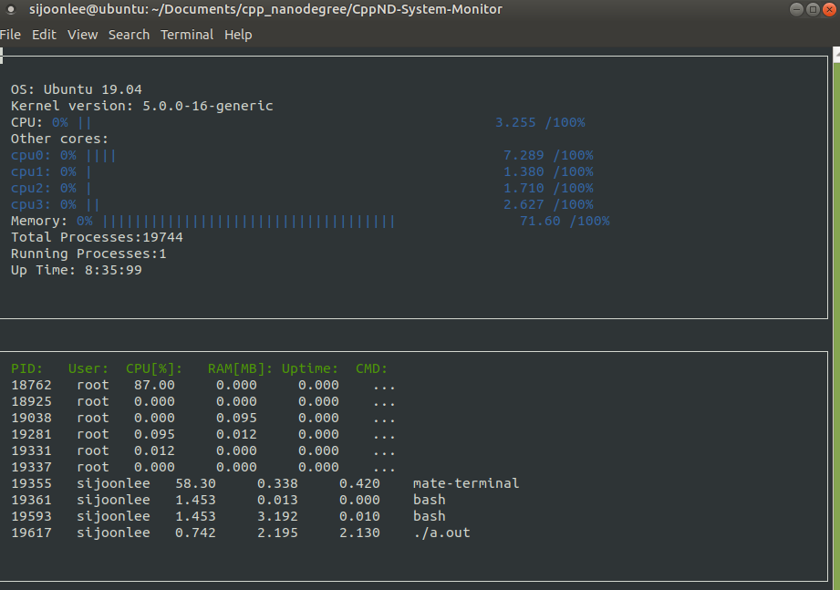

# CppND-System-Monitor

Udacity's [Starter code](https://github.com/udacity/CppND-System-Monitor) is used

This project is to make Linux System Moniter like "htop"

## Dependency - 'ncurse' package
```
sudo apt-get install libncurses5-dev libncursesw5-dev
```

## Compile and run
```
g++ -std="c++17" main.cpp Process.cpp ProcessContainer.cpp ProcessParser.cpp SysInfo.cpp util.cpp -lncurses
./a.out
```

## Screenshot

